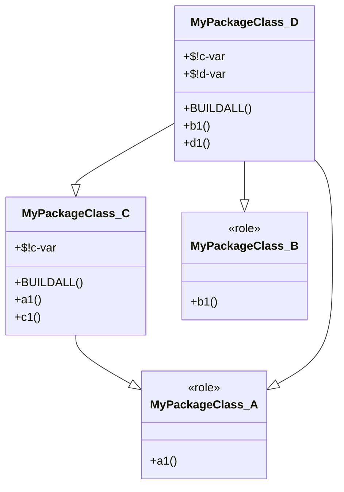

# Raku UML::Translators

## In brief

This repository is for a Raku package for the translations of code into 
[Unified Modeling Language (UML)](https://en.wikipedia.org/wiki/Unified_Modeling_Language) 
specifications and vice versa.

Currently, the package only translates Object-Oriented Programming (OOP) Raku code into: 

- The Domain Specific Language (DSL) of [Mermaid-JS](https://mermaid-js.github.io/mermaid/)

- The DSL of [PlantUML](https://plantuml.com)

- Argument specification of the UML class diagram function [`UMLClassGraph`](https://github.com/antononcube/MathematicaForPrediction/blob/master/Misc/UMLDiagramGeneration.m)
  of the Mathematica / Wolfram Language (WL) package [AAp1] 

See [AA2] for usage examples of both PlantUML and `UMLClassGraph` in Mathematica.

**Remark:** The package provides Command Line Interface (CLI) script.

**Remark:** (Currently) the development of PlantUML is more robust and complete than that of Mermaid-JS.
Hence, workflow-wise, using this package to generate PlantUML specs would produce (on average) best results.

  
### Future plans

A fully fledged version of this package would translate:
- C++, Java, Kotlin, or Raku code into UML specs
- UML specs into C++, Java, Kotlin, or Raku code

Currently, only UML specs are generated to PlantUML's DSL and a much poorer WL DSL.
Ideally, subsequent versions of this package would be able to use UML specifications
encoded in XML and JSON.

------ 

## Installation

### From zef's ecosystem

```
zef install UML::Translators
```

### From GitHub

```
zef install https://github.com/antononcube/Raku-UML-Translators.git 
```

------ 

## Command Line Interface

The package provides the CLI script `to-uml-spec`. Here is its usage message:

```shell
to-uml-spec --help
```
```
# Usage:
#   to-uml-spec <packageName> [--type=<Str>] [-I=<Str>] [--attributes] [--methods] [--concise-grammar-classes] [--format=<Str>] [--plot] [--jar=<Str>] [--viewer=<Str>] -- Make a UML diagram for a specified package.
#   
#     <packageName>                Package name.
#     --type=<Str>                 Type of the UML diagram. [default: 'class']
#     -I=<Str>                     Using include path to find libraries. [default: '']
#     --attributes                 Should the class attributes be included in the UML diagrams or not? [default: True]
#     --methods                    Should the class methods be included in the UML diagrams or not? [default: True]
#     --concise-grammar-classes    Should grammar classes be shortened or not? [default: True]
#     --format=<Str>               Format of the output, one of 'Mermaid', 'MermaidJS', 'Plant', 'PlantUML', 'WL', 'WLUML', or 'Whatever'. [default: 'PlantUML']
#     --plot                       Should the result be plotted or not? [default: False]
#     --jar=<Str>                  JAR file to use if --plot. If --jar is an empty string then PLANTUMLJAR and PLANTUML_JAR are attempted. [default: '']
#     --viewer=<Str>               Image viewer program to use if --plot. If --viewer is an empty string then open is used on macOS and xdg-open on Linux. [default: '']
```

### Usage examples

Generate PlantUML spec for the Raku package 
["ML::Clustering"](https://raku.land/zef:antononcube/ML::Clustering):

```shell
to-uml-spec --/methods --/attributes "ML::Clustering"
```
```
# @startuml
# class "find-clusters" <<routine>> {
# }
# "find-clusters" --|> Routine
# "find-clusters" --|> Block
# "find-clusters" --|> Code
# "find-clusters" --|> Callable
# 
# 
# class "k-means" <<routine>> {
# }
# "k-means" --|> Routine
# "k-means" --|> Block
# "k-means" --|> Code
# "k-means" --|> Callable
# 
# 
# class ML::Clustering::KMeans  {
# }
# ML::Clustering::KMeans --|> ML::Clustering::DistanceFunctions
# 
# 
# class ML::Clustering::DistanceFunctions <<role>> {
# }
# 
# 
# @enduml
```

With this shell command we generate a Plant UML spec for the package 
["Chemistry::Stoichiometry"](https://raku.land/cpan:ANTONOV/Chemistry::Stoichiometry)
and create the UML diagram image with a local PlantUML JAR file (downloaded from [PUML1]):

```
to-uml-spec --/methods --/attributes 'Chemistry::Stoichiometry' | java -jar ~/Downloads/plantuml-1.2022.5.jar -pipe -tjpg > /tmp/myuml.jpg
```

-----

## Raku session

### UML for ad hoc classes

Here we generate a PlantUML spec:

```perl6
use UML::Translators;
module MyPackageClass {
  role A { method a1 {} }
  role B { method b1 {} }
  class C does A { has $!c-var; method c1 {} }
  class D does B is C { has $!d-var; method d1 {} }
}
to-uml-spec('MyPackageClass')
```
```
# @startuml
# class MyPackageClass::C  {
#   {field} $!c-var
#   {method} BUILDALL
#   {method} a1
#   {method} c1
# }
# MyPackageClass::C --|> MyPackageClass::A
# 
# 
# class MyPackageClass::D  {
#   {field} $!c-var
#   {field} $!d-var
#   {method} BUILDALL
#   {method} b1
#   {method} d1
# }
# MyPackageClass::D --|> MyPackageClass::C
# MyPackageClass::D --|> MyPackageClass::A
# MyPackageClass::D --|> MyPackageClass::B
# 
# 
# class MyPackageClass::B <<role>> {
#   {method} b1
# }
# 
# 
# class MyPackageClass::A <<role>> {
#   {method} a1
# }
# 
# 
# @enduml
```

Here we generate a MermaidJS spec:

```perl6, outputPrompt=NONE, outputLang=mermaid
to-uml-spec('MyPackageClass', format => 'mermaid')
```


### UML for packages

Get PlantUML code for the package
['Chemistry::Stoichiometry'](https://raku.land/cpan:ANTONOV/Chemistry::Stoichiometry):

```perl6
say to-uml-spec('Chemistry::Stoichiometry'):!methods:!attributes
```
```
# @startuml
# class Chemistry::Stoichiometry::ResourceAccess  {
# }
# 
# 
# class Chemistry::Stoichiometry::Grammar <<grammar>> {
# }
# Chemistry::Stoichiometry::Grammar --|> Grammar
# Chemistry::Stoichiometry::Grammar --|> Match
# Chemistry::Stoichiometry::Grammar --|> Capture
# Chemistry::Stoichiometry::Grammar --|> Chemistry::Stoichiometry::Grammar::ChemicalElement
# Chemistry::Stoichiometry::Grammar --|> Chemistry::Stoichiometry::Grammar::ChemicalEquation
# Chemistry::Stoichiometry::Grammar --|> NQPMatchRole
# 
# 
# class Chemistry::Stoichiometry::Grammar::ChemicalEquation <<role>> {
# }
# 
# 
# class Chemistry::Stoichiometry::Grammar::ChemicalElement <<role>> {
# }
# 
# 
# class Chemistry::Stoichiometry::Actions::EquationBalance  {
# }
# Chemistry::Stoichiometry::Actions::EquationBalance --|> Chemistry::Stoichiometry::Actions::EquationMatrix
# 
# 
# class Chemistry::Stoichiometry::Actions::MolecularMass  {
# }
# 
# 
# class Chemistry::Stoichiometry::Actions::EquationMatrix  {
# }
# 
# 
# class Chemistry::Stoichiometry::Actions::WL::System  {
# }
# 
# 
# @enduml
```

Get WL UML graph spec for the package [AAp1]:

```perl6
say to-uml-spec('Chemistry::Stoichiometry', format => 'wluml'):!methods:!attributes
```
```
# UMLClassGraph[
# "Parents" -> Flatten[{"Chemistry::Stoichiometry::Grammar" \[DirectedEdge] "Grammar", "Chemistry::Stoichiometry::Grammar" \[DirectedEdge] "Match", "Chemistry::Stoichiometry::Grammar" \[DirectedEdge] "Capture", "Chemistry::Stoichiometry::Grammar" \[DirectedEdge] "Chemistry::Stoichiometry::Grammar::ChemicalElement", "Chemistry::Stoichiometry::Grammar" \[DirectedEdge] "Chemistry::Stoichiometry::Grammar::ChemicalEquation", "Chemistry::Stoichiometry::Grammar" \[DirectedEdge] "NQPMatchRole", "Chemistry::Stoichiometry::Actions::EquationBalance" \[DirectedEdge] "Chemistry::Stoichiometry::Actions::EquationMatrix"}],
# "RegularMethods" -> Flatten[{}],
# "Abstract" -> Flatten[{"Chemistry::Stoichiometry::Grammar::ChemicalElement", "Chemistry::Stoichiometry::Grammar::ChemicalEquation", "NQPMatchRole"}],
# "EntityColumn" -> False, VertexLabelStyle -> "Text", ImageSize -> Large, GraphLayout -> Automatic]
```

### Classes in a name space

Get the classes, roles, subs, and constants of a namespace:

```perl6
.say for namespace-types('ML::TriesWithFrequencies', :how-pairs).sort(*.key)
```
```
# ML::TriesWithFrequencies::LeafProbabilitiesGatherer => Perl6::Metamodel::ClassHOW
# ML::TriesWithFrequencies::ParetoBasedRemover => Perl6::Metamodel::ClassHOW
# ML::TriesWithFrequencies::PathsGatherer => Perl6::Metamodel::ClassHOW
# ML::TriesWithFrequencies::RegexBasedRemover => Perl6::Metamodel::ClassHOW
# ML::TriesWithFrequencies::ThresholdBasedRemover => Perl6::Metamodel::ClassHOW
# ML::TriesWithFrequencies::Trie => Perl6::Metamodel::ClassHOW
# ML::TriesWithFrequencies::TrieTraverse => Perl6::Metamodel::ParametricRoleGroupHOW
# ML::TriesWithFrequencies::Trieish => Perl6::Metamodel::ParametricRoleGroupHOW
# TRIEROOT => Str
# TRIEVALUE => Str
```

------ 

## Potential problems

### Mermaid JS

The package can export class diagrams in the 
[Mermaid-JS format](https://mermaid-js.github.io/mermaid/#/classDiagram).
Unfortunately, currently (November 2022) Mermaid-JS does not support colon characters in class names.
Hence, colons are replaced with underscores.

Also, currently (November 2022) class specs in Mermaid-JS cannot be empty. I.e. the Mermaid JS code
generated here ***will not*** produce a diagram:

```shell
to-uml-spec --/methods --/attributes "ML::Clustering" --format=mermaid  
```
```
# classDiagram
# class ML_Clustering_KMeans {
# }
# ML_Clustering_KMeans --|> ML_Clustering_DistanceFunctions
# 
# 
# class k_means {
#   <<routine>>
# }
# k_means --|> Routine
# k_means --|> Block
# k_means --|> Code
# k_means --|> Callable
# 
# 
# class ML_Clustering_DistanceFunctions {
#   <<role>>
# }
# 
# 
# class find_clusters {
#   <<routine>>
# }
# find_clusters --|> Routine
# find_clusters --|> Block
# find_clusters --|> Code
# find_clusters --|> Callable
```

(Because of the empty definition `ML_Clustering_KMeans {  }`.)

This command should produce Mermaid JS code that will produce diagram:

```
to-uml-spec --/methods --/attributes "ML::Clustering" --format=mermaid  
```

------ 

## References

[AA1] Anton Antonov, et al.,
["Find programmatically all classes, grammars, and roles in a Raku package"](https://stackoverflow.com/q/68622047/14163984),
(2021),
[StackOverflow](https://stackoverflow.com).

[AA2] Anton Antonov,
["Generating UML diagrams for Raku namespaces"](https://community.wolfram.com/groups/-/m/t/2549055),
(2022),
[community.wolfram.com](https://community.wolfram.com).

[AAp1] Anton Antonov,
["UML Diagram Generation Mathematica package"](https://github.com/antononcube/MathematicaForPrediction/blob/master/Misc/UMLDiagramGeneration.m),
(2016),
[MathematicaForPrediction at GitHub/antononcube](https://github.com/antononcube).

[ES1] Eugene Steinberg and Vojtech Krasa, 
[PlantUML integration IntelliJ IDEA plugin](https://plugins.jetbrains.com/plugin/7017-plantuml-integration), 
[JetBrains Plugins Marketplace](https://plugins.jetbrains.com).

[GV1] [graphviz.org](https://graphviz.org).

[PUML1] [plantuml.com](https://plantuml.com).

[PUML2] [PlantUML online demo server](http://www.plantuml.com/plantuml).

[UMLD1] [uml-diagrams.org](https://www.uml-diagrams.org).

[WK1] Wikipedia entry, ["Graphviz"](https://en.wikipedia.org/wiki/Graphviz).

[WK2] Wikipedia entry, ["PlantUML"](https://en.wikipedia.org/wiki/PlantUML).

[WK3] Wikipedia entry, ["Unified Modeling Language"](https://en.wikipedia.org/wiki/Unified_Modeling_Language).

